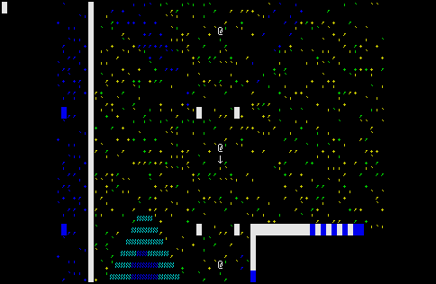

# labyrinth
c++ roguelike with portals

## Gameplay

## Installation / Compilation

It worked on my machine, then I got a new machine.

I vaguely recall that just calling `make` was enough to build it.

Good luck.

(I have since gotten better at setting up build systems, I swear)
